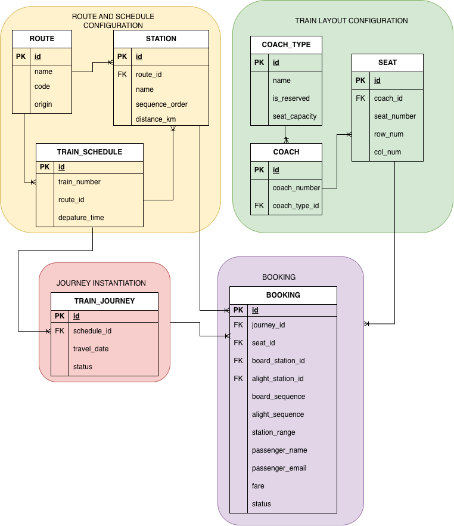

# Segment-Based Train Seat Booking System

A booking system for Sri Lanka's Colombo Fort–Badulla line that allows a single reserved seat to be independently booked by multiple passengers for non-overlapping legs of the same journey — each charged only for the distance they travel.

---

## Entity-Relationship Diagram



---

## The Problem

Sri Lanka Railways' reserved coaches are frequently under-occupied. A seat booked Colombo Fort → Kandy sits empty Kandy → Badulla, because the current system can't resell it once the train departs. To compensate, the department prices reserved seats at a premium — passengers pay for dead legs they don't use. This system removes that constraint.

---

## Running the Project

**Prerequisites:** Docker and Docker Compose installed.

```bash
git clone <repo-url>
cd segment-based-train-seat

cp .env.example .env

docker compose up --build
```

That's it. Docker Compose will:
1. Start PostgreSQL
2. Run database migrations
3. Seed stations, coaches, and seats
4. Start the NestJS backend
5. Start the React frontend

| Service | URL |
|---|---|
| Frontend | http://localhost:5173 |
| Backend API | http://localhost:3000 |
| API Docs (Swagger) | http://localhost:3000/api |

---

## Core Design Decisions

### 1. Segment Occupancy Model

Every booking holds a **half-open integer interval** `[board_sequence, alight_sequence)` on a specific seat within a specific journey. Stations have a `sequence_order` (Colombo Fort = 0, Kandy = 5, Badulla = 15). Two bookings conflict if their intervals overlap:

```
A conflicts with B if: A.board_sequence < B.alight_sequence
                   AND A.alight_sequence > B.board_sequence
```

Half-open ranges make adjacent segments work correctly by design: `[0, 5)` and `[5, 15)` do not overlap — Passenger A disembarks at Kandy (5) exactly as Passenger B boards at Kandy (5). No special edge-case handling needed.

### 2. Concurrency — PostgreSQL EXCLUSION Constraint

The hardest problem is guaranteeing no double-bookings when two requests arrive simultaneously. The solution is a **database-level EXCLUSION constraint** using PostgreSQL's native range types:

```sql
CONSTRAINT no_overlapping_seat_bookings EXCLUDE USING gist (
    journey_id    WITH =,
    seat_id       WITH =,
    station_range WITH &&
) WHERE (status = 'CONFIRMED')
```

`station_range` is a generated stored column (`int4range(board_sequence, alight_sequence, '[)')`). The database computes and maintains it automatically.

When two concurrent requests try to book overlapping segments on the same seat, the database serializes them atomically — one INSERT succeeds, the other receives a constraint violation. The application catches this and returns `409 Conflict`. No application-level locks, no retry loops, no race conditions.

**Why not application-level locking?** It requires a lock table, careful transaction management, and still has failure modes under network partitions. The EXCLUSION constraint is simpler, faster, and guaranteed correct.

**Why not MySQL?** MySQL has no native EXCLUSION constraint. The overlap check would have to live entirely in application code with explicit locks — more complex and less safe. This is the primary reason PostgreSQL was chosen.

### 3. Schedule vs Journey Separation

`TRAIN_SCHEDULE` holds the recurring pattern (train number, departure time). `TRAIN_JOURNEY` is one specific date's run. A single schedule row generates a journey per operating day without data duplication, and the EXCLUSION constraint is correctly scoped per journey — the same physical seat can be booked independently across different dates.

### 4. Fare Calculation

```
fare = (distance_km[alight_station] - distance_km[board_station]) × rate_per_km
```

`rate_per_km` is a configurable environment variable. The fare logic is isolated in a service layer so it can be extended to a fare matrix, class-based pricing, or time-of-day rates without touching booking logic.

### 5. Configurability

Stations, coaches, seats per coach, and fare rate are all seeded from configuration — no magic numbers in code. The department can extend the route, add coaches, or adjust fares via config changes without code changes.

---

## Alternatives Considered

| Decision | Chosen | Alternatives considered |
|---|---|---|
| Backend | Go | NestJS, ASP.NET Core, Django, Spring Boot |
| Router | Chi | Gin, Fiber, stdlib net/http |
| Query layer | sqlc | GORM, sqlx, raw database/sql |
| Migrations | golang-migrate | Atlas, manual SQL |
| Database | PostgreSQL | MySQL (no EXCLUSION constraints), MongoDB (poor fit for relational data) |
| Concurrency | DB EXCLUSION constraint | App-level locking, serializable transactions |
| Frontend | React + Vite | Next.js, Vue, Svelte |
| Infra | Docker Compose | Kubernetes (overkill), bare metal (not reproducible) |

**Go over NestJS:** Compiled binary, lower memory footprint, simpler deployment. The correctness advantage of NestJS's TypeScript (shared types with frontend) doesn't outweigh Go's runtime and toolchain benefits for a production-grade API.

**Go over ASP.NET Core:** Both are compiled and fast. Go produces a smaller binary, has simpler deployment (single static binary), and a more ergonomic toolchain for a focused HTTP API.

**sqlc over GORM:** The overlap query is the heart of the system — sqlc lets you write the exact SQL you intend and generates type-safe Go functions from it. GORM hides the SQL behind an abstraction that makes critical queries harder to audit.

**PostgreSQL over MySQL:** The EXCLUSION constraint is the core correctness mechanism. MySQL doesn't support it.

---

## Extra Credit Features

### Seat Map Visualization
A visual grid per coach showing seat availability in real time. Seats are color-coded (available / booked / selected) and update via polling so the map reflects concurrent bookings without a page refresh.

### Waitlisting
When a booking attempt hits a conflict (`409`), passengers can join a waitlist for that seat+segment. On cancellation, the oldest matching waitlist entry is promoted to `NOTIFIED` and given a time window to complete their booking.

### Admin Dashboard (`/admin`)
- Occupancy heatmap by segment — which legs are full vs empty
- Revenue summary by segment and date
- Bookings table with filters by status, date, and route

### Booking Conflict UX
- Loading state on the confirm button prevents double-submit
- On `409 Conflict`: clear "Seat just taken" message + one-click waitlist join
- Seat map re-fetches after a conflict so the user sees current availability immediately

---

## Project Structure

```
/
├── docker-compose.yml
├── .env.example
├── backend/                  # NestJS API
│   ├── src/
│   │   ├── stations/
│   │   ├── coaches/
│   │   ├── seats/
│   │   ├── bookings/
│   │   ├── waitlist/
│   │   └── admin/
│   ├── prisma/
│   │   ├── schema.prisma
│   │   └── seed.ts
│   └── Dockerfile
├── frontend/                 # React + Vite
│   ├── src/
│   │   ├── components/
│   │   ├── pages/
│   │   └── api/
│   └── Dockerfile
└── README.md
```

---

## Environment Variables

Copy `.env.example` to `.env` before running. Never commit `.env`.

| Variable | Description | Default |
|---|---|---|
| `DATABASE_URL` | PostgreSQL connection string | set in docker-compose |
| `FARE_RATE_PER_KM` | Fare in LKR per km | `2.50` |
| `PORT` | Backend port | `3000` |